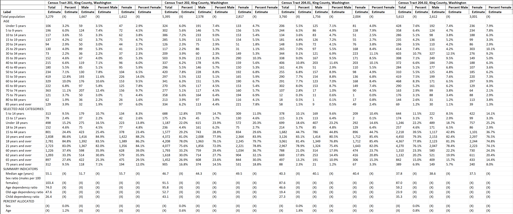
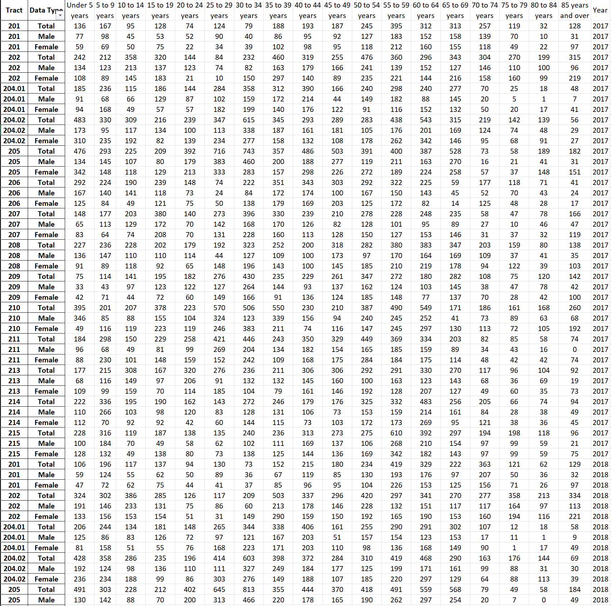

# Demographic change

**Project description:** I Have been volunteering at the [Hunger Intervention Program](https://hungerintervention.org/) at my local area where they are feeding residents in need as a data analyst. I was asked to do some analysis on the demographic changes in the local communities with Census data. 

### 1. Obtaining Data

The data was downloaded from [Census](https://data.census.gov/) in .csv format. However, the data downloaded was not in the format that is suitable for Tableau, therefore, I have to transform the data into long format and remove annotation and margin of error because of its insignificance in this scenario. Below are the picture of the data transformation performed. 
| Before cleaning       | After Cleaning |
| ----------- | ----------- |
|| |

### 2. Analysis

| Dashboards       | Dashboards |
| ----------- | ----------- |
| |  |
| |  

Looking at the age and sex dashboard, there's a decline in population for people over 50 from 2019 across all Census tracts. This aligned with the start of the global pandemic, where the elderly age group were the most affected due to weaker immunity systems. Moreover, it seems like the male elderly have an even greater decline in population. Most drastically from 8.4% to 5.7% for the age group 50-54 from 2019-2020. Though, populations seem to be stabilizing or even increased for the later years in all age groups, which could indicate the effectiveness of vaccination and mask usage. 

Next, if we take a look at the dashboard of poverty status grouped by family size, we see a very interesting trend from 2017-2021. Starting from 2017, we see a decrease in percentage for families of 2 that are in poverty. This could mean that the family providers are able to find new/better opportunities for their family, however, if you look at the number of families in poverty rather than percentages, families of 2 still have a staggering 829 families in poverty status in the King county alone. If we look at the whole demographic, we see that almost all families are steadily increasing in population that are living in poverty. This reveals that the current wages are not enough to be livable and more and more families are in dire help.  

### 3. Limitation
Census data provided a lot of insights on the local demographics, and much more analysis can be done on various factors. There are, in fact, some limitations to it. Though the Census survey is obligated to be filled out by law, this does not prevent anyone from avoiding or ignoring the requirement.  Additionally, there are cases where the questionnaires are filled out erroneously, thus could hinder the legitimacy of responses however small it may be. Lastly, the Census survey is sent out to citizens chosen randomly to answer, therefore, those who chose not to fill out could skew the demographic data significantly. 

For more details see [my Tableau public ](https://guides.github.com/features/mastering-markdown/).

