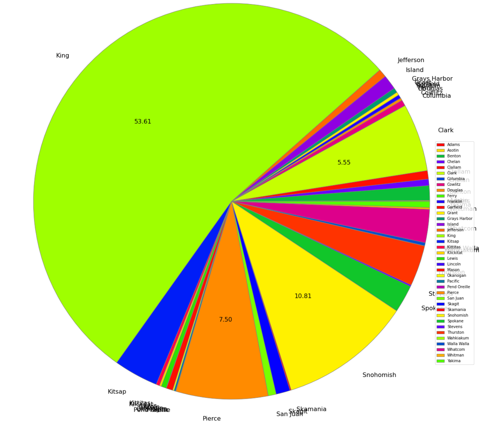

## Introduction
This is an analysis on electrical vehicles registered in the state of Washington released by (data.wa.gov}

After cleaning privacy data such as DOL id and VIN number that are not necessary, I imported the dataset into Jupyter notebook and begun analysis.

## Questions
> 1. How many electric vehicles are registered compared to tradtional petroleum vehicles?
> 2. In the state of Washington, which county has the highest number of registered EV?
> 3. How much has EV been growing since 2017?

## Analysis

The first plot I made was to show the percentage of EV market share on the total number of new vhicles registered 

To my surprise, EV has less than 1% of the whole newly registered vehicles from 2017 to 2022. I assumed this would be higher considering the growing popularity of green and renewable energy. And the fact that almost all major car manufacturing companies have released a EV model, albeit pure EV or hybrid. 

This could be due to the price difference between EV and non-EV. Whenever people think of EV, Tesla is the brand that comes to mind, and Tesla gained a general concensus of being a luxury car suitable for mid-higher social class. Therefore, car buyers would still more likely to stick to tradional gasoline cars with a wider range of price. 

Second, I explored the EV owner distribution within Washington State.
 
As expected, the largest counties in WA would garnered the most EV owners.
King, Pierce, Snohomish, Spokane, and Clark county are the top five largest county by populations. (https://en.wikipedia.org/wiki/List_of_counties_in_Washington)
In the plot included, four counties that have more than 5% EV owner to the total number are all in the top five counties mentioned. interestingly, while Pierce being the second largest populated county, Snohomish have higher percentage of EV owners than Pierce county. 

Lastly, I like to know how much has EV growth been. I was recently in need of a new car and due to the importing issues few months back, options were limited across all dealerships. However, electric vehicles have more in stock than gasolines vehicles. So it piqued my interest, is EV really as popular as manufacturers made them to be?

Looking at the registered EV from 2017 to 2022, we can clearly see growth in people purchasing electric vehicles. Interestingly, in 2022, we see a drop in growth which could be due to a number of factors. It could be due to the importing customs, chip shortages, COVID-19, and general econonmic impact that cause people to stop buying vehicles. Thus, more investigations are needed to answer this questions and it would be interesting to explore deeper into aspects of EV impacts. 

## Thank you for reading!
