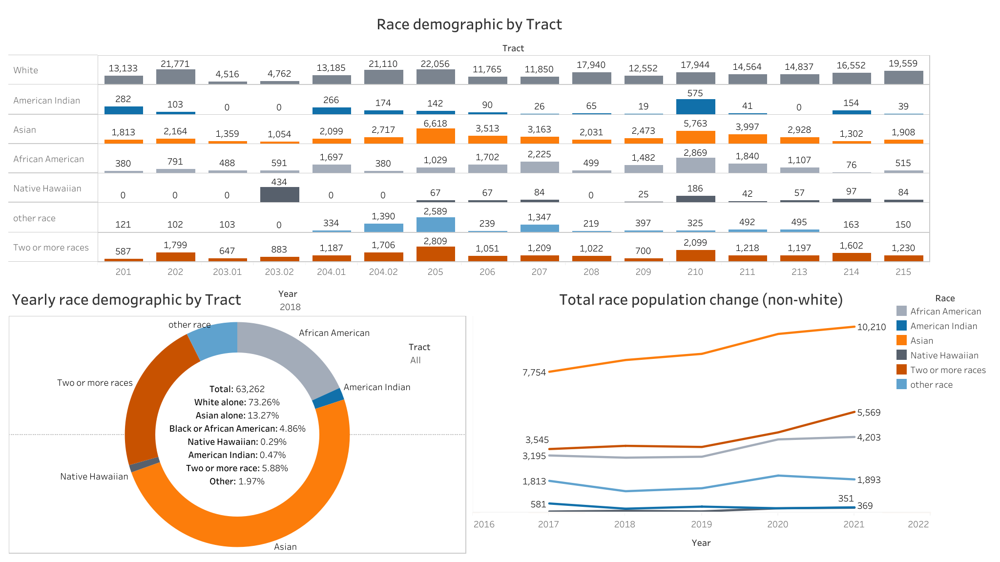
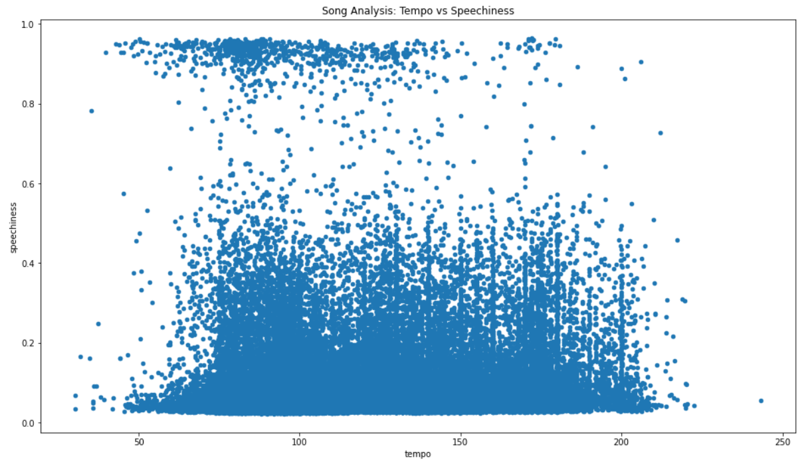

## Portfolio
---

## Highlighted Projects
### [Cosmology Research Project](/pdf/2022Symposium_Kelvin.pdf)
#### Python | R | Excel

---
### [Census Demographic Change](http://example.com/)
#### Tableau | Excel |
| Species      | Species |
| ----------- | ----------- |
|  | |
|  | |
---
## Personal Projects

### [Washington Fish Harvest Record](https://zensius.github.io/WashingtonFishHarvest/)  
Python | Excel

 
### [Electric Vehicle Analysis In Washington](https://zensius.github.io/WA_electricVehicle/) 
 
 
### [Video Game Sales Analysis](https://zensius.github.io/VideoGameSales/)  
 
### [Spotify Popularity Analysis](http://example.com/) 
 
 
