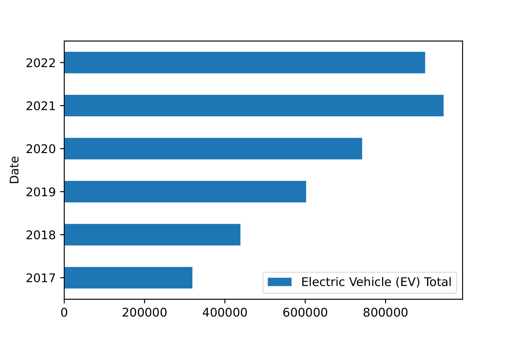

## Portfolio
---
## Current Project
### [8 Weeks SQL Challenge](/sqlChallenge.md)

## Highlighted Projects

### [Cosmology Research Project](/research_project)  
 Python | R | Excel  

### [Census Demographic Change](/Tableau_project)  
 Tableau | Excel | SQL  

---

## Personal Projects

### [Washington Fish Harvest Record](/washington_fish_harvest)  
Python | Excel | SQL  

 
### [Spotify Popularity Analysis on Kaggle](https://www.kaggle.com/code/kelvinzeng/spotify-tracks-analysis#Analysis)  
Jupyter/Python | Excel | SQL   

 
### [Electric Vehicle Analysis In Washington](/electric_vehicle)  
Python | Excel | Pandas  
 
 
### [Video Game Sales Analysis](/video_game_sales)  
Python | Excel | Pandas  
  
 

 
