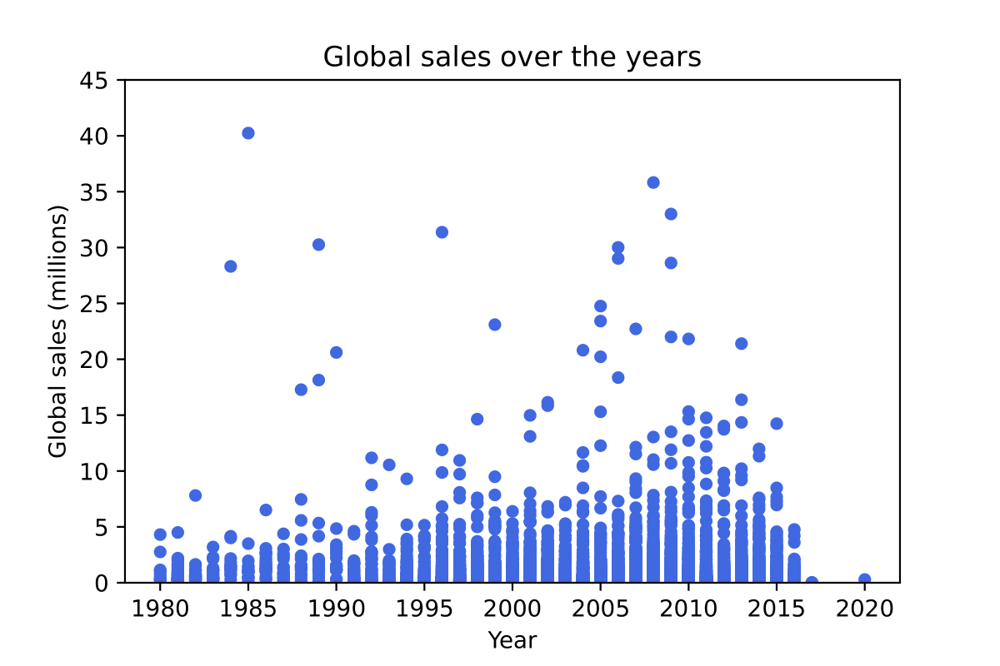

## Portfolio
---

## Highlighted Projects
### [Cosmology Research Project](/pdf/2022Symposium_Kelvin.pdf)
#### Python | R | Excel

---
### [Census Demographic Change](http://example.com/)
#### Tableau | Excel 

---

## Personal Projects

### [Washington Fish Harvest Record](https://zensius.github.io/WashingtonFishHarvest/)  
Python | Excel  

 
### [Electric Vehicle Analysis In Washington](https://zensius.github.io/WA_electricVehicle/)  
Python | Excel  
 
 
### [Video Game Sales Analysis](https://zensius.github.io/VideoGameSales/)  
Python | Excel  
  
 
### [Spotify Popularity Analysis](https://www.kaggle.com/code/kelvinzeng/spotify-tracks-analysis#Analysis)  
Python | Excel   
 
 
