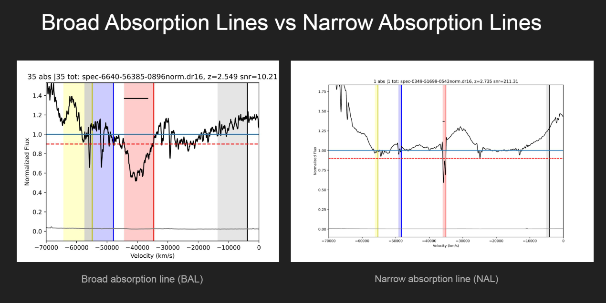
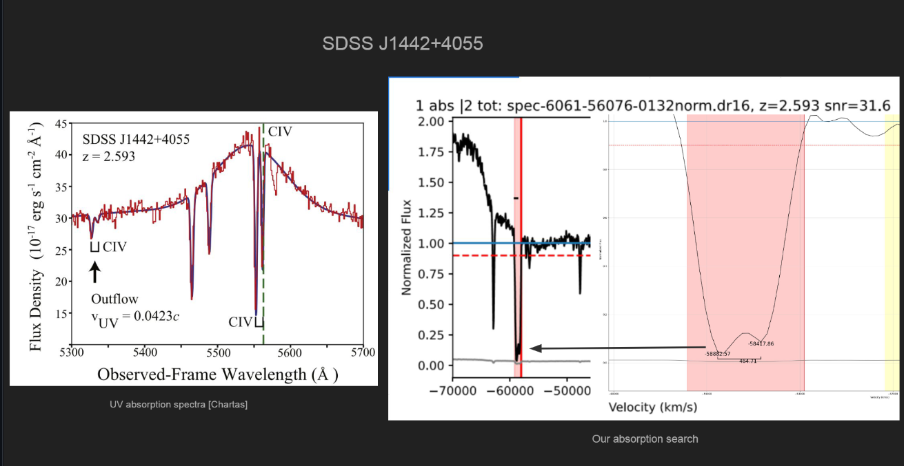

# Cosmology research project

### project description:
Active galactic nuclei (AGNs) are regions at the center of active galaxies.
AGNs have been extensively studied for a long time, they could be a major
contributor of activities such as star formation or even galactic evolution from
AGN feedback. In order to study AGN, a classifying model found that all
AGNs will contain the same components to be classified as an AGN. First of
all, a supermassive black hole will reside at the center of the host galaxy, accom-
panying it will be a disk-like structure known as the accretion disk composed of
dust, gas, and plasma. The accretion disk is heavily involved in transporting
those materials into the central black hole and, as it attains more mass, it also
gains energy from lost momentum. The energy lost from materials within the
accretion disk will transform into heat and radiation ranging from infrared to x-
ray spectrum. Furthermore, AGNs will also contain a donut-shaped structure
composed of dust and gas around the accretion disk called torus. The torus is
able to absorb radiation and obscure information of a given AGN optical spectra
. Therefore, types of AGN detected optically will be based on line of sight
of the accretion disk. In figure 1, depending on the observing angle of the
accretion disk, we see varying amounts of obscured information caused by the
torus ring that surrounds it. A powerful radio jet at the north and south pole
of the blackhole could also be a hindrance when looking at spectra of the AGN.

---

### What we did
We worked with a large set of spectral data requested from Sloan Digital Sky Survey (SDSS) database that records energy intensity at different wavelength of astronomical objects. The data we got was very noisy due to the disturbance and interferance of gas and dust in between Earth and the object. Therefore, we used Python to apply a logarithimic expression to the graph so that it will be normalized to equal level as seen in the picture above. 

After the normalization, we highlighted the area of interest for the specific object to check if there are outflows we're looking for. As you can see in the second picture, different object have varying width of area of interst, specifically the band in red. So another algorithm was used to filter out the objects not within the critia of interest.

---

### What we found
 
To identify further if there are outflow from the object, we need to zoom even further into the spectral graph and calculate the separation distance of the two trough shown above. The specific element in this case will be CIV, which will have a specific separation distance of ~500 nm, so by calculating the separation distance, we can identify wether the given red band is, in fact, Carbon IV. 

---

The whole project was done in Python using packages like Matplotlib and Pandas for visualization and Excel for data organizing and cleaning. 

For more info, please visit: [Github Link](https://github.com/Zensius/DR16Q), [Paper](https://www.overleaf.com/read/fhpvgpxncrxh), [Presentation](pdf/2022Symposium_Kelvin.pdf)
