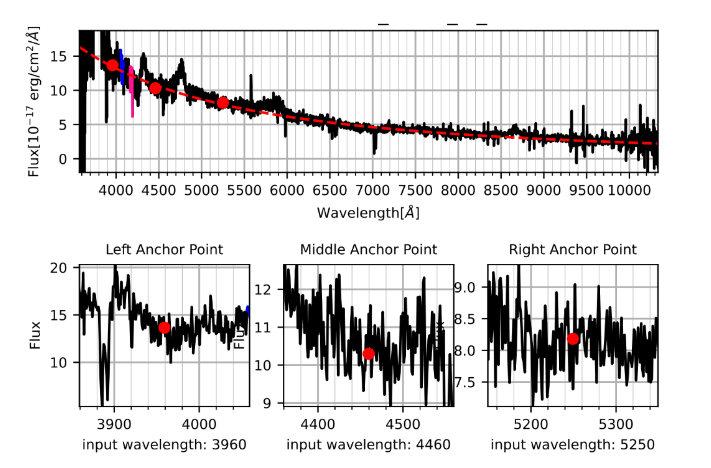

# Cosmology research project

#### project Description:
Active galactic nuclei (AGNs) are regions at the center of active galaxies.
AGNs have been extensively studied for a long time, they could be a major
contributor of activities such as star formation or even galactic evolution from
AGN feedback [1]. In order to study AGN, a classifying model found that all
AGNs will contain the same components to be classified as an AGN[2]. First of
all, a supermassive black hole will reside at the center of the host galaxy, accom-
panying it will be a disk-like structure known as the accretion disk composed of
dust, gas, and plasma[3]. The accretion disk is heavily involved in transporting
those materials into the central black hole and, as it attains more mass, it also
gains energy from lost momentum. The energy lost from materials within the
accretion disk will transform into heat and radiation ranging from infrared to x-
ray spectrum[3]. Furthermore, AGNs will also contain a donut-shaped structure
composed of dust and gas around the accretion disk called torus. The torus is
able to absorb radiation and obscure information of a given AGN optical spectra
[2]. Therefore, types of AGN detected optically will be based on line of sight
of the accretion disk[2]. In figure 1, depending on the observing angle of the
accretion disk, we see varying amounts of obscured information caused by the
torus ring that surrounds it. A powerful radio jet at the north and south pole
of the blackhole could also be a hindrance when looking at spectra of the AGN.

[]
#### Introduction
#### Analysis
#### Contribution 

For more info, please visit: [Github Link](https://github.com/Zensius/DR16Q), [Paper](https://www.overleaf.com/read/fhpvgpxncrxh)
