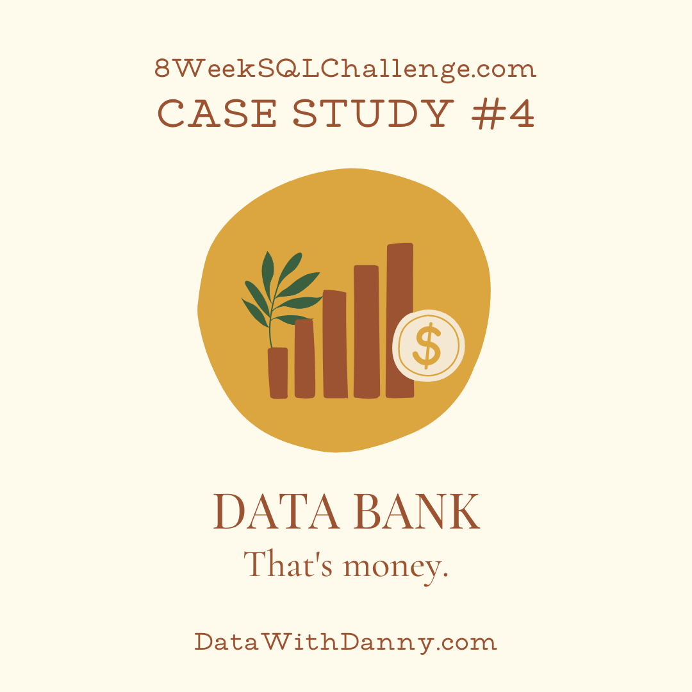
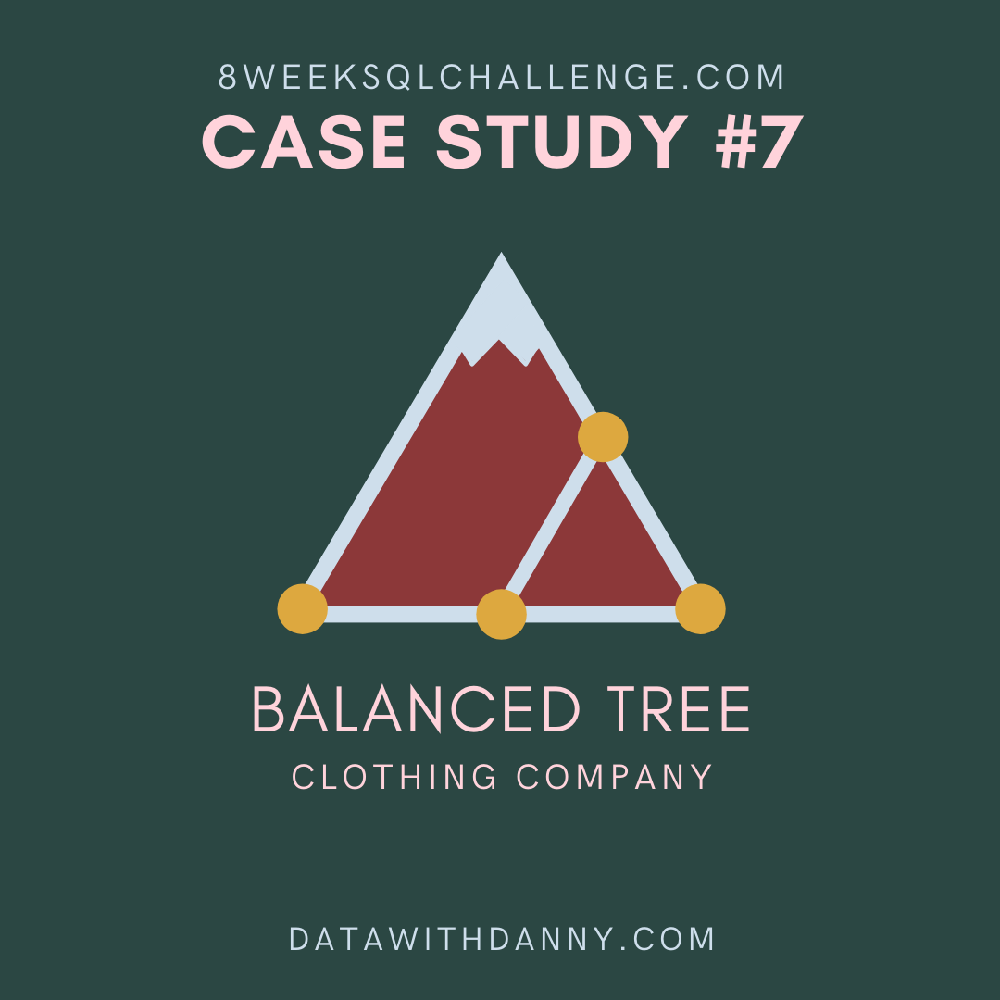

# 8-Week-SQL-Challenge
## Table of Content:
1. [Case Study #1 - Danny's Diner](#week-1) 
2. [Case Study #2 - Pizza Runner](#week-2) 
3. [Case Study #3 - Foodie-Fi](#week-3) 
4. [Case Study #4 - Data Bank](#week-4) 
5. [Case Study #5 - Data Mart](#week-5) 
6. [Case Study #6 - Clique Bait](#week-6) 
7. [Case Study #7 - Balanced Tree Clothing Co.](#week-7) 
8. [Case Study #8 - Fresh Segments](#week-8) 

# Week 1
## Dannys Diner

Danny seriously loves Japanese food so in the beginning of 2021, he decides to embark upon a risky venture and opens up a cute little restaurant that sells his 3 favourite foods: sushi, curry and ramen.

Danny’s Diner is in need of your assistance to help the restaurant stay afloat - the restaurant has captured some very basic data from their few months of operation but have no idea how to use their data to help them run the business.
[Link](https://8weeksqlchallenge.com/case-study-1/)

---

## DATA

```sql
    CREATE SCHEMA dannys_diner;
    SET search_path = dannys_diner;
    
    CREATE TABLE sales (
      "customer_id" VARCHAR(1),
      "order_date" DATE,
      "product_id" INTEGER
    );
    
    INSERT INTO sales
      ("customer_id", "order_date", "product_id")
    VALUES
      ('A', '2021-01-01', '1'),
      ('A', '2021-01-01', '2'),
      ('A', '2021-01-07', '2'),
      ('A', '2021-01-10', '3'),
      ('A', '2021-01-11', '3'),
      ('A', '2021-01-11', '3'),
      ('B', '2021-01-01', '2'),
      ('B', '2021-01-02', '2'),
      ('B', '2021-01-04', '1'),
      ('B', '2021-01-11', '1'),
      ('B', '2021-01-16', '3'),
      ('B', '2021-02-01', '3'),
      ('C', '2021-01-01', '3'),
      ('C', '2021-01-01', '3'),
      ('C', '2021-01-07', '3');
     
    
    CREATE TABLE menu (
      "product_id" INTEGER,
      "product_name" VARCHAR(5),
      "price" INTEGER
    );
    
    INSERT INTO menu
      ("product_id", "product_name", "price")
    VALUES
      ('1', 'sushi', '10'),
      ('2', 'curry', '15'),
      ('3', 'ramen', '12');
      
    
    CREATE TABLE members (
      "customer_id" VARCHAR(1),
      "join_date" DATE
    );
    
    INSERT INTO members
      ("customer_id", "join_date")
    VALUES
      ('A', '2021-01-07'),
      ('B', '2021-01-09');
```


---

## Solutions

1. What is the total amount each customer spent at the restaurant?

```sql
SELECT
  	s.customer_id,
    SUM(m.price) as "Total ($)"
FROM dannys_diner.sales AS s
INNER JOIN dannys_diner.menu AS m ON s.product_id = m.product_id
GROUP BY s.customer_id
```
```
Output: 
| customer_id | Total ($) |
| :---------: | :-------: |
|      B      |    74     |
|      C      |    36     |
|      A      |    76     |
```
---

1. How many days has each customer visited the restaurant?

```sql
SELECT 
	customer_id,
    COUNT(DISTINCT order_date) AS "Visited times"
FROM dannys_diner.sales
GROUP BY customer_id
```
```
Output: 
| customer_id | Visited times |
| :---------: | :-----------: |
|      A      |       4       |
|      B      |       6       |
|      C      |       2       |
```
---

3. What was the first item from the menu purchased by each customer?

```sql
SELECT 
	DISTINCT sales.customer_id,
    menu.product_name
FROM dannys_diner.sales
INNER JOIN dannys_diner.menu ON sales.product_id = menu.product_id
WHERE sales.order_date = '2021-01-01'
limit 3
```
```
Output:
| customer_id | product_name |
| :---------: | :----------: |
|      C      |    ramen     |
|      B      |    curry     |
|      A      |    sushi     |
```
---

4. What is the most purchased item on the menu and how many times was it purchased by all customers?
```sql
SELECT 
	m.product_name,
    COUNT(s.product_id) as times
FROM dannys_diner.sales AS S
INNER JOIN dannys_diner.menu AS m ON s.product_id = m.product_id
GROUP BY m.product_name, s.product_id
ORDER by times DESC
LIMIT 1
```
```
Output:
| product_name | times |
| :----------: | :---: |
|    ramen     |   8   |
```
---

5. Which item was the most popular for each customer?
```sql
WITH temp as (SELECT customer_id, product_name
FROM dannys_diner.sales as s
JOIN dannys_diner.menu as m ON s.product_id = m.product_id)
SELECT customer_id, product_name,  count(product_name) 
FROM temp
GROUP BY customer_id, product_name
ORDER BY count(product_name) DESC
```
```
Output:
| customer_id | product_name | count |
| :---------: | :----------: | :---: |
|      C      |    ramen     |   3   |
|      A      |    ramen     |   3   |
|      B      |    curry     |   2   |
|      B      |    sushi     |   2   |
|      B      |    ramen     |   2   |
|      A      |    curry     |   2   |
|      A      |    sushi     |   1   |
```
---

6. Which item was purchased first by the customer after they became a member?
```sql
SELECT DISTINCT ON (order_date) s.customer_id, order_date, product_name, join_date
FROM dannys_diner.sales as s
JOIN dannys_diner.members as m ON s.customer_id = m.customer_id
JOIN dannys_diner.menu as men ON s.product_id = men.product_id
WHERE join_date <= order_date
ORDER BY order_date
LIMIT 2
```
```
Output: 
| customer_id |        order_date        | product_name |        join_date         |
| :---------: | :----------------------: | :----------: | :----------------------: |
|      A      | 2021-01-07T00:00:00.000Z |    curry     | 2021-01-07T00:00:00.000Z |
|      A      | 2021-01-10T00:00:00.000Z |    ramen     | 2021-01-07T00:00:00.000Z |
```

---

7. Which item was purchased just before the customer became a member?
```sql
SELECT DISTINCT ON (s.customer_id) s.customer_id, order_date, product_name, join_date 
FROM dannys_diner.sales as s
Join dannys_diner.members as mem ON s.customer_id = mem.customer_id
JOIN dannys_diner.menu as m ON s.product_id = m.product_id
WHERE join_date > order_date
```
```
Output: 
| customer_id	order_date |       product_name       | join_date |
| :--------------------: | :----------------------: | :-------: |
|           A            | 2021-01-01T00:00:00.000Z |   sushi   | 2021-01-07T00:00:00.000Z |
|           B            | 2021-01-04T00:00:00.000Z |   sushi   | 2021-01-09T00:00:00.000Z |
```
---

8. What is the total items and amount spent for each member before they became a member?
```sql
WITH temp as (SELECT s.customer_id, s.product_id, price
FROM dannys_diner.sales AS s
JOIN dannys_diner.menu AS m ON s.product_id = m.product_id
JOIN dannys_diner.members AS mem ON s.customer_id = mem.customer_id
WHERE order_date < join_date)

SELECT customer_id as Members, count(product_id) as "Products bought", sum(price)
FROM temp
GROUP BY customer_id
```
Output: 

| members | Products bought |  sum  |
| :-----: | :-------------: | :---: |
|    B    |        3        |  40   |
|    A    |        2        |  25   |

---

9.  If each $1 spent equates to 10 points and sushi has a 2x points multiplier - how many points would each customer have?
```sql
WITH temp AS (
SELECT customer_id, s.product_id, product_name, price
FROM dannys_diner.sales as s
JOIN dannys_diner.menu as m ON s.product_id = m.product_id)

SELECT DISTINCT ON (customer_id) customer_id, 
SUM(CASE WHEN product_id = 1 THEN 20*price ELSE 10*price END) AS point
FROM temp
GROUP BY temp.customer_id
```
```
Output: 
| customer_id | point |
| :---------: | :---: |
|      A      |  860  |
|      B      |  940  |
|      C      |  360  |
```
---

10. In the first week after a customer joins the program (including their join date) they earn 2x points on all items, not just sushi - how many points do customer A and B have at the end of January?
```sql
SELECT s.customer_id, SUM(CASE WHEN ABS(order_date-join_date) <= 7 THEN price*20 ELSE price*10 END) AS "points earned"
FROM dannys_diner.sales AS s
Join dannys_diner.menu AS m ON s.product_id = m.product_id
JOIN dannys_diner.members as mem ON s.customer_id = mem.customer_id
WHERE EXTRACT(MONTH FROM order_date) < 2
GROUP BY s.customer_id
```
```
Output: 
| customer_id | points earned |
| :---------: | :-----------: |
|      A      |     1520      |
|      B      |     1090      |
```
---

## Bonus Question

Join All The Things
The following questions are related creating basic data tables that Danny and his team can use to quickly derive insights without needing to join the underlying tables using SQL.
```sql
SELECT s.customer_id, order_date, product_name, price, 
	CASE 
    	WHEN mem.join_date > s.order_date THEN 'N'
    	WHEN mem.join_date <= s.order_date THEN 'Y'
    	ELSE 'N'
   	END AS members
FROM dannys_diner.sales AS s
LEFT JOIN dannys_diner.menu AS m ON s.product_id = m.product_id
LEFT JOIN dannys_diner.members AS mem ON mem.customer_id = s.customer_id
ORDER BY s.customer_id, order_date
```
```
Output:
| customer_id |        order_date        | product_name | price | members |
| :---------: | :----------------------: | :----------: | :---: | :-----: |
|      A      | 2021-01-01T00:00:00.000Z |    curry     |  15   |    N    |
|      A      | 2021-01-01T00:00:00.000Z |    sushi     |  10   |    N    |
|      A      | 2021-01-07T00:00:00.000Z |    curry     |  15   |    Y    |
|      A      | 2021-01-10T00:00:00.000Z |    ramen     |  12   |    Y    |
|      A      | 2021-01-11T00:00:00.000Z |    ramen     |  12   |    Y    |
|      A      | 2021-01-11T00:00:00.000Z |    ramen     |  12   |    Y    |
|      B      | 2021-01-01T00:00:00.000Z |    curry     |  15   |    N    |
|      B      | 2021-01-02T00:00:00.000Z |    curry     |  15   |    N    |
|      B      | 2021-01-04T00:00:00.000Z |    sushi     |  10   |    N    |
|      B      | 2021-01-11T00:00:00.000Z |    sushi     |  10   |    Y    |
|      B      | 2021-01-16T00:00:00.000Z |    ramen     |  12   |    Y    |
|      B      | 2021-02-01T00:00:00.000Z |    ramen     |  12   |    Y    |
|      C      | 2021-01-01T00:00:00.000Z |    ramen     |  12   |    N    |
|      C      | 2021-01-01T00:00:00.000Z |    ramen     |  12   |    N    |
|      C      | 2021-01-07T00:00:00.000Z |    ramen     |  12   |    N    |
```

```sql
WITH temp AS (SELECT s.customer_id, order_date, product_name, price, 
	CASE 
    	WHEN mem.join_date > s.order_date THEN 'N'
    	WHEN mem.join_date <= s.order_date THEN 'Y'
    	ELSE 'N'
   	END AS members
FROM dannys_diner.sales AS s
LEFT JOIN dannys_diner.menu AS m ON s.product_id = m.product_id
LEFT JOIN dannys_diner.members AS mem ON mem.customer_id = s.customer_id
ORDER BY s.customer_id, order_date)

SELECT *, 
	CASE
    WHEN members = 'N' then NULL
    ELSE
    	RANK () OVER(PARTITION BY customer_id, members
      	ORDER BY order_date) END AS ranking
FROM temp;
```
```
Output:
| customer_id |        order_date        | product_name | price | members | ranking |
| :---------: | :----------------------: | :----------: | :---: | :-----: | :-----: |
|      A      | 2021-01-01T00:00:00.000Z |    curry     |  15   |    N    |  null   |
|      A      | 2021-01-01T00:00:00.000Z |    sushi     |  10   |    N    |  null   |
|      A      | 2021-01-07T00:00:00.000Z |    curry     |  15   |    Y    |    1    |
|      A      | 2021-01-10T00:00:00.000Z |    ramen     |  12   |    Y    |    2    |
|      A      | 2021-01-11T00:00:00.000Z |    ramen     |  12   |    Y    |    3    |
|      A      | 2021-01-11T00:00:00.000Z |    ramen     |  12   |    Y    |    3    |
|      B      | 2021-01-01T00:00:00.000Z |    curry     |  15   |    N    |  null   |
|      B      | 2021-01-02T00:00:00.000Z |    curry     |  15   |    N    |  null   |
|      B      | 2021-01-04T00:00:00.000Z |    sushi     |  10   |    N    |  null   |
|      B      | 2021-01-11T00:00:00.000Z |    sushi     |  10   |    Y    |    1    |
|      B      | 2021-01-16T00:00:00.000Z |    ramen     |  12   |    Y    |    2    |
|      B      | 2021-02-01T00:00:00.000Z |    ramen     |  12   |    Y    |    3    |
|      C      | 2021-01-01T00:00:00.000Z |    ramen     |  12   |    N    |  null   |
|      C      | 2021-01-01T00:00:00.000Z |    ramen     |  12   |    N    |  null   |
|      C      | 2021-01-07T00:00:00.000Z |    ramen     |  12   |    N    |  null   |
```
[Back to Top](#8-week-sql-challenge)


---

# Week 2

Did you know that over 115 million kilograms of pizza is consumed daily worldwide??? (Well according to Wikipedia anyway…)

Danny was scrolling through his Instagram feed when something really caught his eye - “80s Retro Styling and Pizza Is The Future!”

Danny was sold on the idea, but he knew that pizza alone was not going to help him get seed funding to expand his new Pizza Empire - so he had one more genius idea to combine with it - he was going to Uberize it - and so Pizza Runner was launched!

Danny started by recruiting “runners” to deliver fresh pizza from Pizza Runner Headquarters (otherwise known as Danny’s house) and also maxed out his credit card to pay freelance developers to build a mobile app to accept orders from customers.


## Data
---
## Solution
[Back to Top](#8-week-sql-challenge)
---

# Week 3

Subscription based businesses are super popular and Danny realised that there was a large gap in the market - he wanted to create a new streaming service that only had food related content - something like Netflix but with only cooking shows!

Danny finds a few smart friends to launch his new startup Foodie-Fi in 2020 and started selling monthly and annual subscriptions, giving their customers unlimited on-demand access to exclusive food videos from around the world!

Danny created Foodie-Fi with a data driven mindset and wanted to ensure all future investment decisions and new features were decided using data. This case study focuses on using subscription style digital data to answer important business questions.

---
## Data
---
## Solution
[Back to Top](#8-week-sql-challenge)
---

# Week 4

There is a new innovation in the financial industry called Neo-Banks: new aged digital only banks without physical branches.

Danny thought that there should be some sort of intersection between these new age banks, cryptocurrency and the data world…so he decides to launch a new initiative - Data Bank!

Data Bank runs just like any other digital bank - but it isn’t only for banking activities, they also have the world’s most secure distributed data storage platform!

Customers are allocated cloud data storage limits which are directly linked to how much money they have in their accounts. There are a few interesting caveats that go with this business model, and this is where the Data Bank team need your help!

The management team at Data Bank want to increase their total customer base - but also need some help tracking just how much data storage their customers will need.

This case study is all about calculating metrics, growth and helping the business analyse their data in a smart way to better forecast and plan for their future developments!

---
## Data
---
## Solution
[Back to Top](#8-week-sql-challenge)
---

# Week 5

Data Mart is Danny’s latest venture and after running international operations for his online supermarket that specialises in fresh produce - Danny is asking for your support to analyse his sales performance.

In June 2020 - large scale supply changes were made at Data Mart. All Data Mart products now use sustainable packaging methods in every single step from the farm all the way to the customer.

Danny needs your help to quantify the impact of this change on the sales performance for Data Mart and it’s separate business areas.

The key business question he wants you to help him answer are the following:

- What was the quantifiable impact of the changes introduced in June 2020?
- Which platform, region, segment and customer types were the most impacted by this change?
- What can we do about future introduction of similar sustainability updates to the business to minimise impact on sales?

---
## Data
---
## Solution
[Back to Top](#8-week-sql-challenge)
---

# Week 6

Clique Bait is not like your regular online seafood store - the founder and CEO Danny, was also a part of a digital data analytics team and wanted to expand his knowledge into the seafood industry!

In this case study - you are required to support Danny’s vision and analyse his dataset and come up with creative solutions to calculate funnel fallout rates for the Clique Bait online store.

---
## Data
---
## Solution
[Back to Top](#8-week-sql-challenge)
---

# Week 7

Balanced Tree Clothing Company prides themselves on providing an optimised range of clothing and lifestyle wear for the modern adventurer!

Danny, the CEO of this trendy fashion company has asked you to assist the team’s merchandising teams analyse their sales performance and generate a basic financial report to share with the wider business.


---
## Data
---
## Solution
[Back to Top](#8-week-sql-challenge)
---

# Week 8

Danny created Fresh Segments, a digital marketing agency that helps other businesses analyse trends in online ad click behaviour for their unique customer base.

Clients share their customer lists with the Fresh Segments team who then aggregate interest metrics and generate a single dataset worth of metrics for further analysis.

In particular - the composition and rankings for different interests are provided for each client showing the proportion of their customer list who interacted with online assets related to each interest for each month.

Danny has asked for your assistance to analyse aggregated metrics for an example client and provide some high level insights about the customer list and their interests.


---
## Data
---
## Solution
[Back to Top](#8-week-sql-challenge)