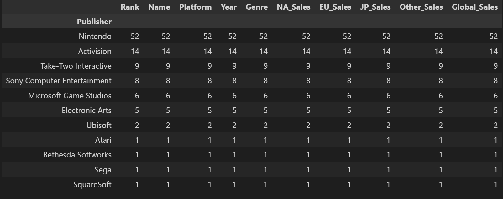
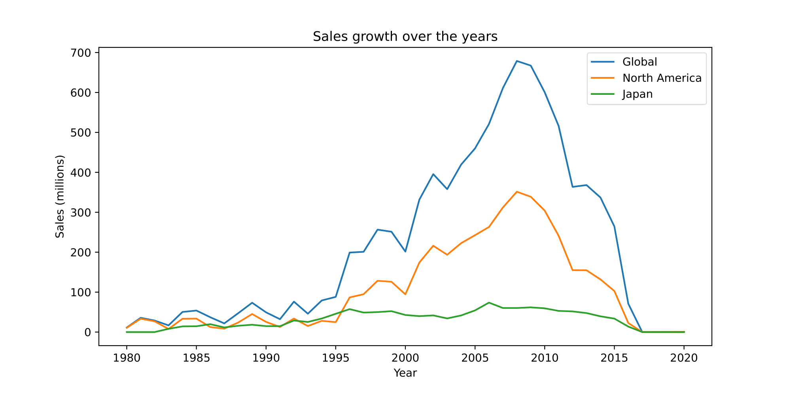
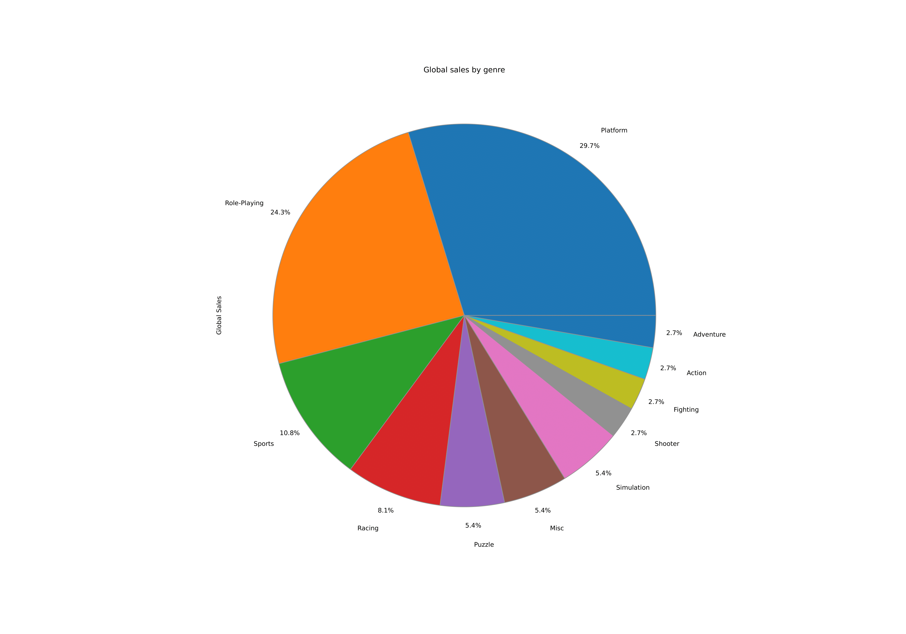
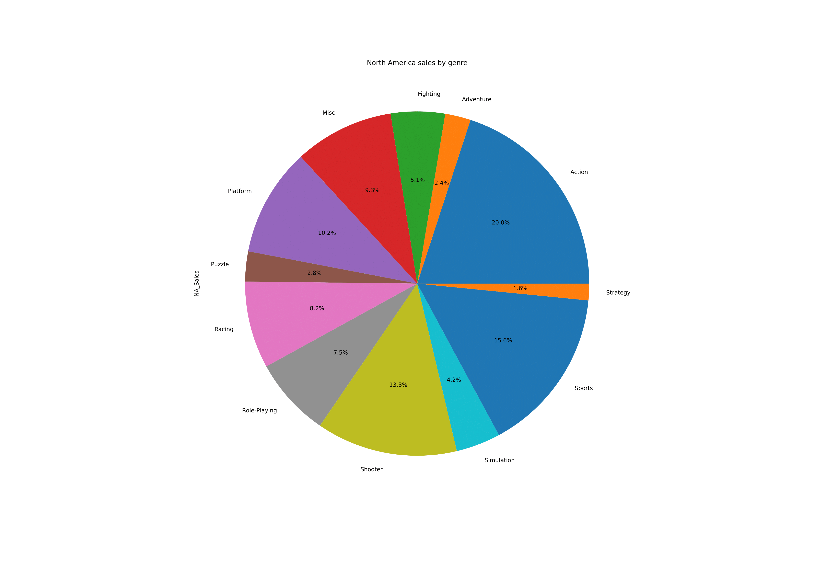
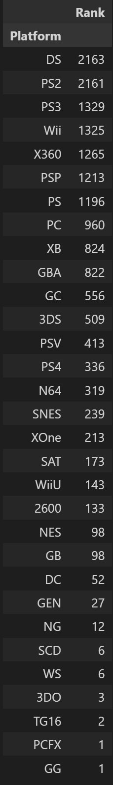

## Introduction
---
Being the gamer I am, I don't really know much about them outside of the usual genre that I like. I've always been curious about the statistics on video game sales. I've seen old gaming magazines on retro game prices at staggering $70 back in the 90s. Compared to the recent decade, video game prices have remained relatively the same, excluding collector's editions. How has the genre of games evolved? It seems like FPS and MOBA games are dominating the market today, with Riot games and Bungie being the most well known for their games. Therefore, I downloaded this data set on [Kaggle](https://kaggle.com) to analyze publisher, total sales, popularity in genre, and more.
## Questions
1. What year did video games become popular and entertainment of choice among teenagers?
2. What is the most popular Genre of games
3. What studio is the most popular and sold the most games?
4. What game sold the most?
## Analysis
---
We first look at the top publisher based on the games they've published. While having most games does not indicate the most popular or the most sold, it would show which publisher is willing to invest into new projects.
 
It seems like Nintendo has a staggering lead compared to the second place publisher being Activision. Note that this dataset was obtained before Activision acquisition of Blizzard entertainment. Therefore, I believe that most of the titles from Activision are from the Call of Duty franchise. 

 
Next I want to analyze the global sales over the years. Looking at the trends, it seems like since the very beginning, the gaming industry has been growing steadily throughout the years. With more and more outliers as the years go by, indicating the number of games exceeding the audience beyond gamers are on the climb. With Super Mario Brothers released back in 1985 still being one of the most well known game today. 

 
Next, I want to investigate the sales over the years by specifically analyzing two large holder market shares, Japan and North America. Interestingly enough, while most developing studios and publishers reside in Japan, North American sales numbers are double and even triple the amount of Japan sales when gaming became more mainstream in the early 2000s.

 
 
Additionally, when looking at the games sold by genre from Japan and Americans, it’s quite remarkable how different these two region’s interest in games. While Japanese favor slow, dialogue heavy role-playing games, and platforming games like the Mario and Donkey Kong franchise, North Americans prefer fast paced action, first-person shooter, and sports games. 

Lastly, I want to highlight the limitations of this dataset. It seems like this dataset is heavily skewed by the amount of console and handheld games, especially the Nintendo DS platform. While In today’s market, consoles like the Playstation, Xbox, and Nintendo Switch are still maintaining their popularity, PC games are more favored to adapt to the online free-to-play model of recently released games. Yet all those four mentioned platforms are still dwarfed by the mobile game industry. With a 92.2 billion USD revenue in 2022, compared to 51.8 billion in console. A more updated dataset which includes mobile games such as Genshin impact would be interesting to see how it compares. 

Source: [link](https://www.statista.com/statistics/292751/mobile-gaming-revenue-worldwide-device/#:~:text=In%202022%2C%20mobile%20games%20are,U.S.%20dollars%20in%20global%20revenue.)
---

That is the end of my analysis. 
Thanks for reading! 
